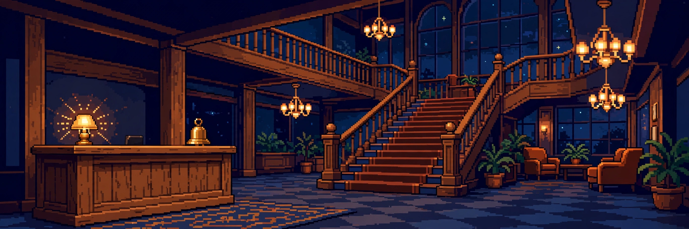

# Front desk by shift, frontend after shift.

```ts
const me = {
  dayJob: "hotel trainee in Rostock",
  nightJob: "building small projects",
  stack: ["TypeScript", "JavaScript", "Python"],
  learning: "machine learning",
  quest: "build something people actually use",
};
```

### Check-in

Welcome to my lobby. I'm Abel. I run a hotel front desk by day and build small projects by night. The problems change, the approach doesn't: listen first, then fix it.

### Rooms

Each room is a tiny game or experiment I built between shifts. Pick a door, any door.

- **101 · [project-board](https://github.com/aichrisz/project-board):** a command center for all my side projects
- **102 · [lobby-ledger](https://github.com/aichrisz/lobby-ledger):** shift handover notes, digitized (Früh, Spät, Nacht approved)
- **103 · [portfolio-hub](https://github.com/aichrisz/portfolio-hub):** the front door of this hotel
- **104 · [hotel-lobby-chaos-simulator](https://github.com/aichrisz/hotel-lobby-chaos-simulator):** my workplace, but playable
- **105 · [queue-quest](https://github.com/aichrisz/queue-quest):** adventures sized for waiting lines
- **106 · [blank-zero](https://github.com/aichrisz/blank-zero):** every match becomes unique artwork

### Checkout

No checkout time here. The desk is always open:

🌍 [aichrisz.com](https://aichrisz.com) · 📍 Rostock, Germany

### Guest book

Enjoyed your stay? Sign the guest book and tell me where you're visiting from: [leave a note](https://github.com/aichrisz/aichrisz/issues/new)
