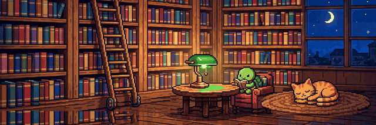

# Front desk by shift, frontend after shift.

```ts
const me = {
  dayJob: "hotel trainee in Rostock",
  nightJob: "building small projects",
  stack: ["TypeScript", "JavaScript", "Python"],
  quest: "build something people actually use",
};
```

### Check-in

Welcome to my lobby. Willkommen. Selamat datang. I'm Abel. I run a hotel front desk by day and build small projects by night. The problems change, the approach doesn't: listen first, then fix it.

### Lobby mascot

Meet **Moin**, the lobby turtle. He runs on commits: busy weeks keep him happy, quiet weeks make him hungry, long silence tucks him in for a nap.


Psst, guests can feed, bathe and play with him over at [his house](https://github.com/aichrisz/aichrisz/issues/1).

### Rooms

Each room is a tiny game or experiment I built between shifts. Pick a door, any door.

- **101 · [project-board](https://github.com/aichrisz/project-board):** a command center for all my side projects
- **102 · [shift-cockpit](https://github.com/aichrisz/shift-cockpit):** phone-first shift handover checklist, in DE, EN and ID
- **103 · [one-button-universe](https://github.com/aichrisz/one-button-universe):** a one-button cosmic sandbox, from dust to black holes
- **104 · [hotel-lobby-chaos-simulator](https://github.com/aichrisz/hotel-lobby-chaos-simulator):** my workplace, but playable
- **105 · [captcha-hell](https://github.com/aichrisz/captcha-hell):** where proving you are human turns into existential horror
- **106 · [blank-zero](https://github.com/aichrisz/blank-zero):** every match becomes unique artwork
- **404 ·** room not found (yet)

### Lobby game: find Moin's key

Every day, Moin hides his spare key in one of the rooms 101-106. Guess the room by [opening a play issue](https://github.com/aichrisz/aichrisz/issues/new?template=game.yml). One guess per day, a correct guess is 1 point, a wrong guess gets you a hot/cold hint.

<!-- GAME:START -->
| Player | Points |
| --- | --- |
| 🥇 @aichrisz | 1 |
<!-- GAME:END -->

### The hotel at night

Every lit window is a day with commits. Dark windows are rest days, and rest days are part of the job.


### Checkout

No checkout time here. The desk is always open:

🌍 [aichrisz.com](https://aichrisz.com) · 📍 Rostock, Germany

### Guest book

Enjoyed your stay? [Sign the guest book](https://github.com/aichrisz/aichrisz/issues/new?template=guestbook.yml) and tell me where you're visiting from.

<!-- GUESTBOOK:START -->
<!-- The first signature appears here once a guest signs. -->
<!-- GUESTBOOK:END -->


